# 产品报告：掌上终端（Android SSH/SFTP 客户端）

## 目录

1. 产品功能介绍
2. 程序概要设计与软件架构
3. 技术亮点及其实现原理
4. 总结

## 一、产品功能介绍

### 1. 核心定位

掌上终端是一款为开发者与服务器管理员设计、运行在 Android 平台上的轻量级 SSH/SFTP 客户端。应用采用现代化的 Jetpack Compose UI 与 MVVM 架构，旨在提供流畅、稳定的远程管理体验。

### 2. 功能列表

#### 2.1 SSH 终端（Terminal）

- 安全连接：支持通过 IP 地址、用户名与密码连接到标准 SSH 服务器。
- 交互式 Shell：提供实时、可交互的 Shell 环境，支持连续执行命令并查看完整输出，体验接近桌面终端。

#### 2.2 SFTP 文件管理器（File Manager）

- 远程文件浏览：以图形化列表展示远程服务器文件系统。
- 目录导航：支持进入子目录与返回上一级。
- 文件上传/下载：支持从手机选择文件上传至服务器当前目录；支持将服务器文件下载到手机公共“下载”目录。
- 文件管理：支持创建新目录、删除文件/文件夹（含防误删确认）、重命名文件/文件夹等核心操作。

#### 2.3 远程文件编辑器（Editor）

- 文件预览：支持在应用内打开并预览服务器上的文本文件内容。
- 在线编辑：支持直接修改文本内容，并通过“保存”将更改写回服务器。

## 二、程序概要设计与软件架构

### 1. 核心架构：MVVM

项目采用 Google 官方推荐的 MVVM（Model-View-ViewModel）设计模式，实现 UI、业务逻辑与数据源解耦。

- View（视图层）
  - 实现：`MainActivity.kt` 中的 Composable UI。
  - 职责：仅负责界面渲染；展示数据来自 ViewModel。用户操作（点击、输入等）作为事件通知 ViewModel。
- ViewModel（业务与状态层）
  - 实现：`SshViewModel.kt` 中的 `SshViewModel`。
  - 职责：持有并管理 UI 状态（连接状态、终端输出、文件列表、编辑器内容等）；响应 View 事件，调用 Repository 执行操作并更新状态。
- Repository（数据与协议封装层）
  - 实现：`SshRepository.kt` 中的 `SshRepository`。
  - 职责：封装 SSH/SFTP 具体实现，直接与第三方库 `JSch` 交互；将耗时网络操作通过 Kotlin `Flow` 与回调包装为清晰接口供 ViewModel 调用。

### 2. 架构交互图

> Mermaid 源码见 `产品报告-架构图.mmd`（部分 Markdown/PDF 渲染器不支持 Mermaid，故在报告中以静态图呈现）。

## 三、技术亮点及其实现原理

1. 现代化 UI 构建
   - 技术：Jetpack Compose 声明式 UI。
   - 原理：以 Kotlin 函数描述界面；结合 `StateFlow` 与 `collectAsState()` 实现响应式状态驱动 UI，当 ViewModel 数据变化时，UI 自动高效重组（Recomposition），降低状态管理复杂度。
2. 高效的异步任务处理（保证性能）
   - 技术：Kotlin 协程（Coroutines）与 `Flow`。
   - 原理：SSH 连接、命令执行、SFTP 操作等网络任务统一放在 `Dispatchers.IO` 执行，避免阻塞主线程；终端输出等连续数据通过 `Flow` 持续接收并展示，体验更接近原生终端。
3. 清晰的 MVVM 架构实践
   - 技术：ViewModel/Repository 分层。
   - 原理：将 UI 状态与业务逻辑从 Composable 抽离，解决生命周期场景（如旋转屏幕）下的数据保持问题；Repository 封装底层实现细节，提升可维护性与可测试性。
4. 完善的 Android 系统 API 交互
   - 技术：`ActivityResultContracts`、`MediaStore`。
   - 原理：使用 `rememberLauncherForActivityResult` 调用系统文件选择器实现上传，避免旧式 `startActivityForResult`；下载通过 `MediaStore` 保存到公共“下载”目录，减少分区存储与权限处理成本，提升版本兼容性。

## 四、总结

掌上终端将 SSH 终端、SFTP 文件管理与远程文本编辑整合到 Android 端，并以 Jetpack Compose + MVVM + 协程/Flow 的方式实现“状态清晰、交互流畅、网络操作不阻塞”的远程管理体验。
